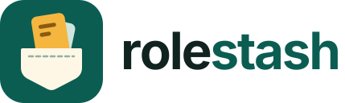

[](https://github.com/SHINO-01/rolestash/actions/workflows/ci.yml)
[](https://github.com/SHINO-01/rolestash/releases)

**The private job application tracker.** No AI reading your applications,
nothing from your inbox on our servers, no data selling.

Save any job posting to a Kanban board in one click. Rolestash is a Chrome
extension that reads the job page you're on, extracts the title, company,
location, salary, dates and description, and files it as a card on a local
board you drag through _Saved → Applied → Screening → Interviewing → Offer_.

- **No AI.** Extraction is deterministic: structured data first
  (schema.org JSON-LD and microdata), then 50 hand-written site adapters, then
  conservative heuristics. Every field records where it came from.
- **Local-first.** Your data lives in `chrome.storage.local`. The free plan
  needs no account and makes no network requests beyond the page you capture.
  Accounts, sync and email updates are Pro, the one paid plan, on our own
  backend (Supabase, payments by Paddle). Connected Gmail or Outlook mail is
  read on the device, never on our servers (ADR-0032). No analytics, no remote
  code, no AI vendors.
- **A button on job sites, reading nothing until you open it.** The floating
  widget's button sits at the edge of supported job sites, and of every site
  if you turn that on (ADR-0033). It checks only whether a job is open, and
  reads the page only when you open the panel.

## Using it

| Action                     | How                                                                                                                             |
| -------------------------- | ------------------------------------------------------------------------------------------------------------------------------- |
| Capture, review, then save | The Rolestash button at the edge of a job site (it says _Save job_), or the toolbar icon / <kbd>Alt</kbd>+<kbd>J</kbd> anywhere |
| Save instantly (no review) | Right-click the page → _Track this job_, or <kbd>Alt</kbd>+<kbd>Shift</kbd>+<kbd>J</kbd>                                        |
| Fill an application        | The widget → _Fill this application_, or right-click → _Fill this application with Rolestash_                                   |
| Open the board             | The widget's board icon, or right-click the toolbar icon → _Open Rolestash board_                                               |
| Search the board           | <kbd>/</kbd>                                                                                                                    |
| Add a job by hand          | <kbd>N</kbd> on the board                                                                                                       |
| Back up / move browsers    | Board menu → _Export backup_ / _Import backup_                                                                                  |

Badge feedback for instant saves: **✓** saved, **=** already on your board,
**!** couldn't read the page.

## Getting started (development)

Requires Node 22.18+ (see `.nvmrc`). Work happens on `dev`; CI promotes green
commits to `main` and tags releases. Packaging and Chrome Web Store releases live
in [rolestash-extension](https://github.com/SHINO-01/rolestash-extension).

```bash
npm install
npm run dev          # launches Chrome with the extension and hot reload
npm run build        # production build → .output/chrome-mv3
npm run zip          # store-ready zip → .output/*.zip
npm run verify       # format + lint + typecheck + unit tests + build (what CI runs)
npm run test:e2e     # Playwright against the real built extension and web board
npm run test:db      # database tests (pgTAP, needs Docker)
npm run site:clips   # re-record the homepage feature clips from the real product
npm run release -- patch   # prepare a release (see docs/guides/releasing.md)
```

To load a build manually: `chrome://extensions` → enable _Developer mode_ →
_Load unpacked_ → select `.output/chrome-mv3`.

## Project layout

```
src/
  entrypoints/   Extension surfaces: background worker, widget (launcher + panel), board page, injected extractor
  domain/        Pure business model (Job, Stage, ranking, state transitions) — zod schemas
  extraction/    Pure extraction engine: strategies, normalisers, 50 site adapters
  storage/       Repositories over a KeyValueStore port, migrations, backup format
  services/      Application use cases (JobService, CaptureService) + composition root
  platform/      The only code that touches chrome.* APIs (adapters for the ports)
  features/      UI features: board/ (Kanban, drawer, dialogs), capture/ (the widget)
  ui/            Design system: tokens, primitives, hooks
tests/
  unit/          Vitest (happy-dom) — domain, extraction, storage, services, board logic
  fixtures/      HTML fixtures; drop in <case>.html + <case>.expected.json to add a test
  e2e/           Playwright — loads the real extension into Chromium
  web/           Playwright — the web board against the mock backend
  clips/         Records the homepage feature clips (npm run site:clips)
web/             The phone-first web board (rolestash.com/board/, built in CI)
site/            rolestash.com (static pages, deployed when CI promotes)
supabase/        Database migrations, tests and Edge Functions (accounts, sync, billing)
infra/           Cloudflare: the site Worker, email ingest, operations dashboard
docs/            Knowledge base (start at docs/README.md)
```

## Documentation

The knowledge base lives in [`docs/`](docs/README.md): architecture, decision
records, how-to guides (adding a site adapter, debugging extraction, releasing)
and reference material (data model, storage and migrations, permissions,
supported sites). Contributors — human or AI agent — should read
[`AGENTS.md`](AGENTS.md) first.

## Status

v0.4.7 (one Pro plan, the floating widget, Gmail or Outlook read on the
device). See [`docs/roadmap.md`](docs/roadmap.md) for what's next,
[`docs/todo.md`](docs/todo.md) for what's open and
[`CHANGELOG.md`](CHANGELOG.md) for what changed.
