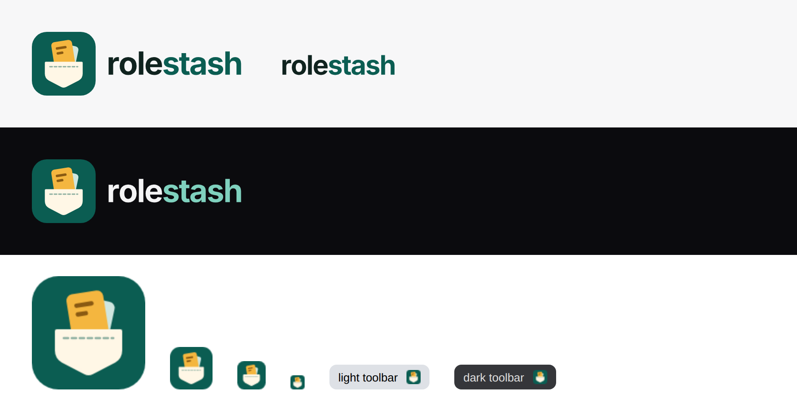

# Rolestash brand

**The mark:** a job card dropping into a stitched pocket shaped like a
shield. It stands for stashing every role you find and keeping it private.
The mint card behind the amber one shows there's more than one role in the
stash.

## Files

| File                       | Use                                                         |
| -------------------------- | ----------------------------------------------------------- |
| `rolestash-mark.svg`       | App/extension icon, favicon, avatars                        |
| `png/rolestash-mark-*.png` | 16/32/48/96/128 px extension icons; 512 px store and social |
| `rolestash-logo.svg`       | Mark + wordmark on light backgrounds                        |
| `rolestash-logo-dark.svg`  | Mark + wordmark on dark backgrounds                         |
| `rolestash-wordmark.svg`   | Wordmark alone, where the mark already appears nearby       |

The wordmark is Inter at weight 680, converted to outlines. The files need no
font installed.

## Colours

| Token       | Hex       | Use                                     |
| ----------- | --------- | --------------------------------------- |
| Spruce      | `#0B5D52` | Primary: icon tile, "stash", buttons    |
| Offer amber | `#F4B63F` | Highlight: the newest card, key actions |
| Cream       | `#FFF7E6` | Pocket, light surfaces                  |
| Mint        | `#CFE6DF` | Secondary cards, soft fills             |
| Ink         | `#10231F` | "role", body text on light              |
| Mint text   | `#7FD1BE` | "stash" on dark backgrounds             |

## Rules

- Write the name as **Rolestash** in sentences. The lowercase **rolestash**
  appears only in the logo.
- Keep clear space around the logo equal to the pocket's height.
- Don't recolour, rotate, outline or add shadows to the mark, and don't
  place it on busy photos.
- Minimum size: 16 px for the mark, 80 px wide for the full logo.
